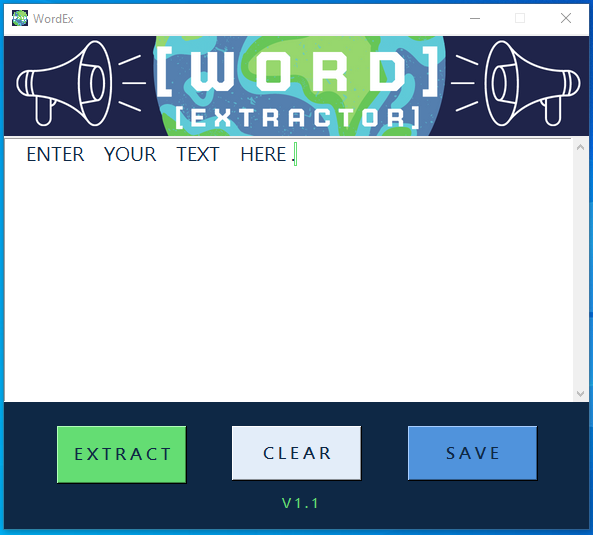

<body>
<h1>WELCOME TO WORD EXTRACTOR</h1>

<h2>Supported Languages</h2>

    - English
    - Spanish
    - French

<h1>WordEx Design</h1>

<h2>How to use WordEx</h2>

Type or paste a sentence into the text box then press the EXTRACT button to
convert the given string to a list of words.

To save the extracted words in a text file you must press the SAVE button.

To clear all text from the text box press the CLEAR button.

<a href="https://www.youtube.com/watch?v=c2h0Tvu2El4"> Watch the Youtube Video here</a>

<h4>Why Word Ex was created?</h4>

This was initially made as a function that was very important for one of my Python CLI applications.

While I was learning Python I discovered this amazing tool called <a href="https://github.com/alejandroautalan/pygubu-designer">Pygubu Designer</a>
to help speed up the process of creating GUI applications in python, so I decided to try it out and WordEx was created.

</body>
